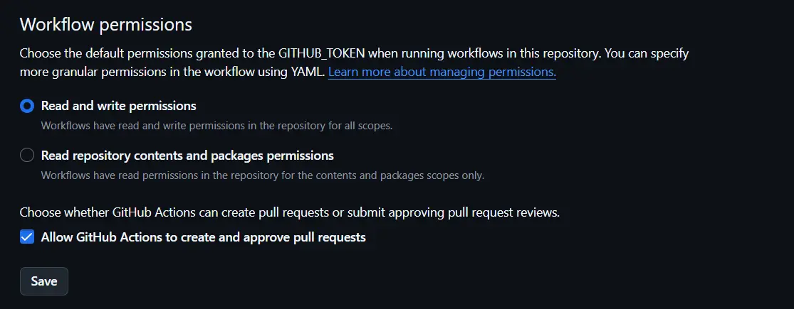
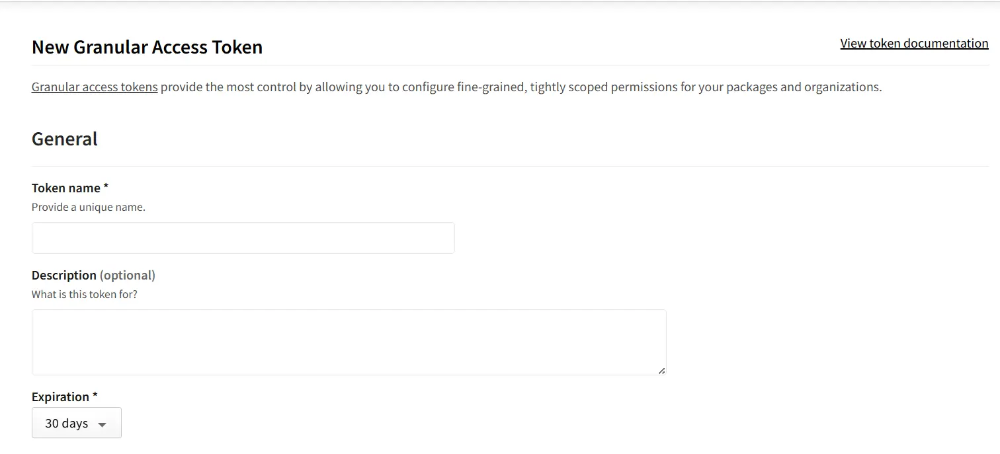
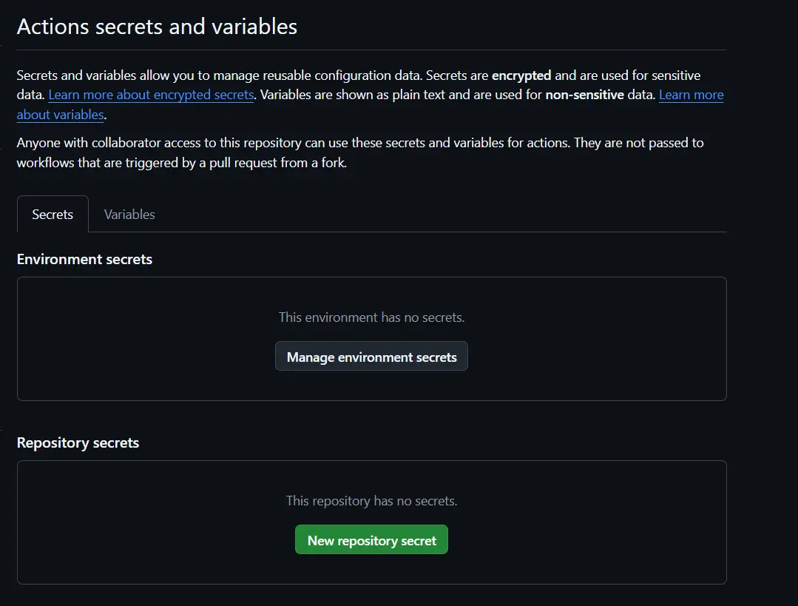
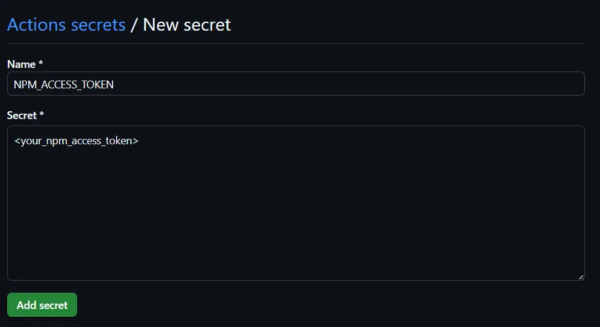
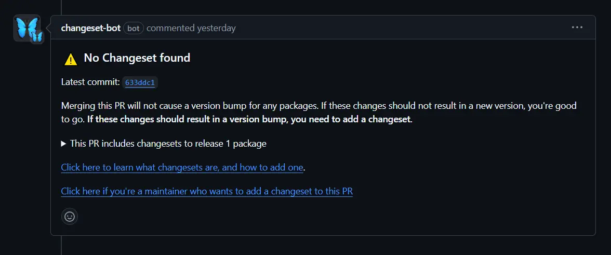
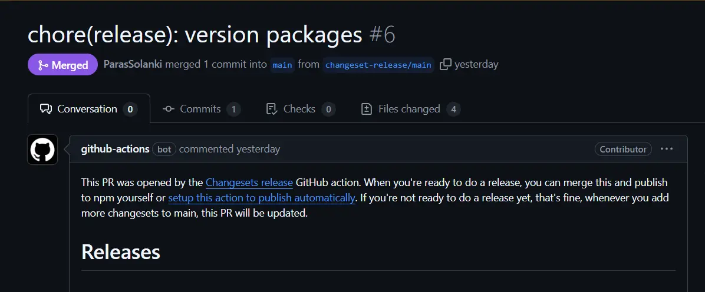
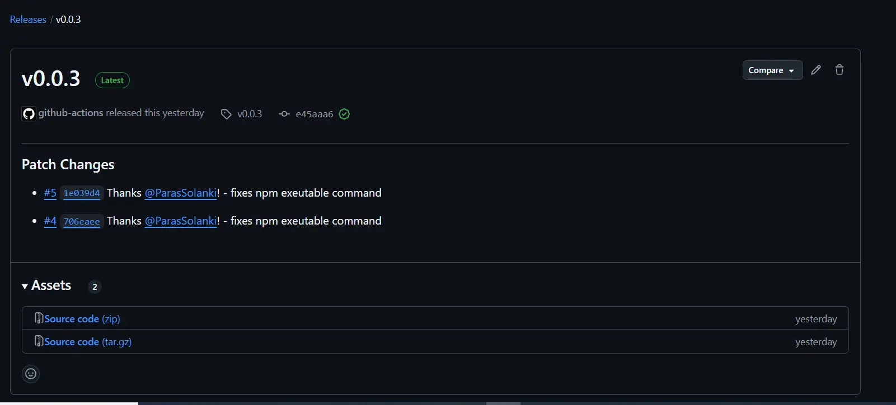

Let's say you have a npm package which is published to npm registry. But you don't like the manual process of releasing it. You want an automated way which is reliable adds changelog and overall fastens the release process.

Here is a step by step guide on how to automate the release process.


## What is changeset?

Before we start, let's understand what is changeset.

[Changeset](https://github.com/changesets/changesets?tab=readme-ov-file) is a tool that helps you manage your changelog and release process. 


In order to automate the Github releases and NPM package publishing, we can use GitHub Actions with [Changesets Releaser Action](https://github.com/changesets/action).


## Setting up the repository permissions

In order to automate the changeset releases, we need to setup the repository permissions which allows the GitHub Actions to create a tags, releases and pull requests.

For this step, we need to go to the repository `Settings` -> `Actions` -> `General`. 

You will see the workflow permissions section at the bottom of the page:



You need to enable the following permissions:

- Grant read and write permissions to GITHUB_TOKEN.
- Allow Github Actions to create and approve pull requests.


## Setting up NPM access tokens

Next step is to generate an NPM access token. If you already have an automation token, skip the creation step and use it (provided that you have saved it somewhere).

Navigate to [npmjs.org](https://www.npmjs.com/), and log in if you're not already.

Go to `Profile Picture` → `Access Tokens` → `Generate New Token` → `Granular Access Token`.

Give it a propper name, select needed package, scopes and permissions.

Now generate it by clicking on the **Generate Token** button.



At this point, the token will be shown. Copy it and save it somewhere safe, because you won't be able to see it again.

## Setting up Repository Secrets and Variables

Now, we need to store this generated NPM token in our repository's secrets and variables. 

For that go back to your repository and then navigate to `Settings` → `Secrets and variables` → `Actions`.



Click on the **New repository secret** button. You'll be presented with the "New secret" form.

Add a new secret as `NPM_ACCESS_TOKEN` and the secret should be the NPM token you generated in the previous step. 



Save the secret by clicking on the **Add secret** button.


## Setting up Changeset

Now, we need to setup the changeset in our repository.

First, we need to install the `@changesets/cli` and `@changesets/changelog-github` package.

> I am using `pnpm` as my package manager. If you are using different package manager, please refer to the [Changeset documentation](https://github.com/changesets/changesets?tab=readme-ov-file#installation) for the correct installation command.

```shell
pnpm add -D @changesets/cli @changesets/changelog-github
```

We need to also initialize the changeset in our repository. Run the following command:

```shell
pnpm dlx changesets init
```

It will create a `.changeset` folder in your project, containing a `config.json` file. This is also where your changesets will live.

Make your changeset release public by adding the following to your `config.json` file:

```json filename=".changeset/config.json"
{
  "access": "public"
}
```

Also, change the `changelog` field to `@changesets/changelog-github` and add your GitHub repository name to the `repo` field.

```json filename=".changeset/config.json"
{
  "changelog": ["@changesets/changelog-github", { "repo": "your-github-username/your-repo-name" }]
}
```

Set `commit` field to `false` as well. This will prevent changesets from committing the changes to the repository.

```json filename=".changeset/config.json"
{
  "commit": false
}
```

Now, we need to add the following scripts to your `package.json` file:


```json filename="package.json"
{
  "scripts": {
    "release:version": "changeset version",
    "release:publish": "changeset publish"
  }
}
```

## Setting up GitHub Actions

Now, we need to setup the GitHub Actions workflow.

Create a new file in the `.github/workflows` folder called `release.yml`.

Let's give it a name "Release".

```yaml filename=".github/workflows/release.yml"
name: Release
```

Next, we need to define the event that will trigger the workflow. In this case, we want to trigger the workflow when a push is made to the `main` branch.

```yaml filename=".github/workflows/release.yml"
on:
  push:
    branches:
      - main
```

Also, we will define the concurrency. This will prevent previous runs if a new one is triggered.

```yaml filename=".github/workflows/release.yml"
# cancel previous runs if a new one is triggered
concurrency:
  group: ${{ github.workflow }}-${{ github.event.number || github.ref }}
  cancel-in-progress: true
```

Now, let's first define `create_pr` job which will create a pull request.


```yaml filename=".github/workflows/release.yml"
jobs:
   create_pr:
    runs-on: ubuntu-latest
    name: Create PR    
```

Let's add the steps to the job.

First step, we need to checkout the repository.

```yaml filename=".github/workflows/release.yml"
-   name: Checkout
    uses: actions/checkout@v4
    with:
      fetch-depth: 0
```

Second step, we need to install Node.js.

```yaml filename=".github/workflows/release.yml"
- uses: actions/setup-node@v4
  name: Install Node.js
  with:
    node-version: 22 # This is the node version for the create_pr job
```

Third step, we need to install pnpm.

```yaml filename=".github/workflows/release.yml"
- name: Install pnpm
  uses: pnpm/action-setup@v3
  id: pnpm-install
  with:
    run_install: false
```

Fourth step, we need to get the pnpm store directory. This is used to cache the pnpm store directory.

You can skip this step if you are not using pnpm.

```yaml filename=".github/workflows/release.yml"
- name: Get pnpm store directory
  id: pnpm-cache
  run: |
    echo "pnpm_cache_dir=$(pnpm store path)" >> $GITHUB_OUTPUT
```

Fifth step, we need to cache the pnpm store directory. This is used to cache the pnpm store directory.

You can skip this step if you are not using pnpm.

```yaml filename=".github/workflows/release.yml"
- uses: actions/cache@v4
  name: Setup pnpm cache
  with:
    path: ${{ steps.pnpm-cache.outputs.pnpm_cache_dir }}
    key: ${{ runner.os }}-pnpm-store-${{ hashFiles('**/pnpm-lock.yaml') }}
    restore-keys: |
      ${{ runner.os }}-pnpm-store-
```

Sixth step, we need to install the dependencies.

```yaml filename=".github/workflows/release.yml"
- name: Install dependencies
  run: pnpm install
```

Before we add final create version PR step, we need to create a `changeset-version.js` file. This file will be used to get the version of the package.

The `npx changeset version` try to look up for major, minor and patch changes and bump the project's version accordingly.

In order for `changeset` to to do this, we need to run `pnpm changeset` to create a new changeset or version bump. For more information, please refer to this guide [Adding a changeset](https://github.com/changesets/changesets/blob/main/docs/adding-a-changeset.md).

It will ask you to select an appropriate bump type for the changes made and provide the changelog for the changeset.

After this, a new changeset will be added which is a markdown file with YAML front matter.

To detect the changeset on the pull request you can setup the changeset bot on your repository which will comment on the pull request with the changeset status.




```js filename=".github/changeset-version.js"
import { exec } from "child_process";
// This script is used by the `release.yml` workflow to update the version of the packages being released.
// The standard step is only to run `changeset version` but this does not update the package-lock.json file.
// So we also run `npm install`, which does this update.
// This is a workaround until this is handled automatically by `changeset version`.
// See https://github.com/changesets/changesets/issues/421.
exec("npx changeset version");
exec("npm install");
```

Next, we need to create the version PR. We need to use the `changesets/action` action to create the PR. For more information, please refer to the [Changesets Release Action](https://github.com/changesets/action?tab=readme-ov-file#changesets-release-action).



```yaml filename=".github/workflows/release.yml"
- name: Create Version PR
  id: changesets
  uses: changesets/action@v1
  with:
    setupGitUser: true
    commit: "chore(release): version packages" # This is the commit message
    title: "chore(release): version packages" # This is the title of the PR
    version: node .github/changeset-version.js # This is the version of the package
    env:
      GITHUB_TOKEN: ${{ secrets.GITHUB_TOKEN }}
```

So, now when you push to the `main` branch, it will create a PR with the changeset version.

To publish the package to NPM, we need to add another job called `release` which will run when the generated PR is merged and has changesets.

We need to add the following steps to the `release` job. This job needs to run only when the `create_pr` job has changesets.

```yaml filename=".github/workflows/release.yml"
jobs:
  release:
    name: Release
    needs: create_pr 
    runs-on: ubuntu-latest
    if: needs.create_pr.outputs.hasChangesets == 'false'
```

Most of the steps are the same, but we need to add a step to create the `.npmrc` file.

```yaml filename=".github/workflows/release.yml"
- name: Creating .npmrc
  run: |
    cat << EOF > "$HOME/.npmrc"
      //registry.npmjs.org/:_authToken=$NPM_TOKEN
    EOF
```

Next, add a step to run the build.

```yaml filename=".github/workflows/release.yml"
- name: Run build
  run: pnpm build # This is the build command for your project
  env:
    NODE_ENV: "production" # Add any environment variables you need
```

Next, add a step to publish the package to NPM. We will use the release script we created in the previous steps.

```yaml filename=".github/workflows/release.yml"
- name: Publish to NPM
  id: changesets
  uses: changesets/action@v1
  with:
    publish: pnpm release:publish # This is the publish command for your project
  env:
    GITHUB_TOKEN: ${{ secrets.GITHUB_TOKEN }}
    NPM_TOKEN: ${{ secrets.NPM_ACCESS_TOKEN }}
    NODE_ENV: "production"
```

Once this step is ran for the second time, a new Release will be added to repository. The name of this release will be the new bumped version, and the description will contain all changes added by the contributors**.**



Complete `release.yml` file:

```yaml filename=".github/workflows/release.yml"
name: Release

on:
  push:
    branches:
      - main

# cancel previous runs if a new one is triggered
concurrency:
  group: ${{ github.workflow }}-${{ github.event.number || github.ref }}
  cancel-in-progress: true


jobs:
  create_pr:
    runs-on: ubuntu-latest
    name: Create PR
    outputs:
      hasChangesets: ${{ steps.changesets.outputs.hasChangesets }}
    steps:
      - name: Checkout
        uses: actions/checkout@v4
        with:
          fetch-depth: 0

      - name: Install Node.js
        uses: actions/setup-node@v4
        with:
          node-version: 22 # This is the node version for the create_pr job

      - name: Install pnpm
        uses: pnpm/action-setup@v3
        id: pnpm-install
        with:
          run_install: false

      - name: Get pnpm store directory
        id: pnpm-cache
        run: |
          echo "pnpm_cache_dir=$(pnpm store path)" >> $GITHUB_OUTPUT

      - name: Setup pnpm cache
        uses: actions/cache@v4
        with:
          path: ${{ steps.pnpm-cache.outputs.pnpm_cache_dir }}
          key: ${{ runner.os }}-pnpm-store-${{ hashFiles('**/pnpm-lock.yaml') }}
          restore-keys: |
            ${{ runner.os }}-pnpm-store-

      - name: Install dependencies
        run: pnpm install

      - name: Create Version PR
        id: changesets
        uses: changesets/action@v1
        with:
          setupGitUser: true
          commit: "chore(release): version packages"
          title: "chore(release): version packages"
          version: node .github/changeset-version.js
        env:
          GITHUB_TOKEN: ${{ secrets.GITHUB_TOKEN }}


  release:
    needs: create_pr
    runs-on: ubuntu-latest
    name: Release Package to npm
    if: needs.create_pr.outputs.hasChangesets == 'false'
    steps:
      - name: Checkout
        uses: actions/checkout@v4
        with:
          fetch-depth: 0

      - name: Install Node.js
        uses: actions/setup-node@v4
        with:
          node-version: 22 # This is the node version for the release job

      - uses: pnpm/action-setup@v3
        name: Install pnpm
        id: pnpm-install
        with:
          run_install: false

      - name: Get pnpm store directory
        id: pnpm-cache
        run: |
          echo "pnpm_cache_dir=$(pnpm store path)" >> $GITHUB_OUTPUT

      - name: Setup pnpm cache
        uses: actions/cache@v4
        with:
          path: ${{ steps.pnpm-cache.outputs.pnpm_cache_dir }}
          key: ${{ runner.os }}-pnpm-store-${{ hashFiles('**/pnpm-lock.yaml') }}
          restore-keys: |
            ${{ runner.os }}-pnpm-store-

      - name: Install dependencies
        run: pnpm install

      - name: Creating .npmrc
        run: |
          cat << EOF > "$HOME/.npmrc"
            //registry.npmjs.org/:_authToken=$NPM_TOKEN
          EOF
        env:
          NPM_TOKEN: ${{ secrets.NPM_ACCESS_TOKEN }}

      - name: Run build
        run: pnpm build 
        env:
          NODE_ENV: "production"

      - name: Publish to NPM
        id: changesets
        uses: changesets/action@v1
        with:
          publish: pnpm release:publish
        env:
          GITHUB_TOKEN: ${{ secrets.GITHUB_TOKEN }}
          NPM_TOKEN: ${{ secrets.NPM_ACCESS_TOKEN }}
          NODE_ENV: "production"
```

## Conclusion   

This is a basic guide on how to automate the changeset releases. You can extend this guide to your needs.

Thank you for reading this and I hope you liked it!
